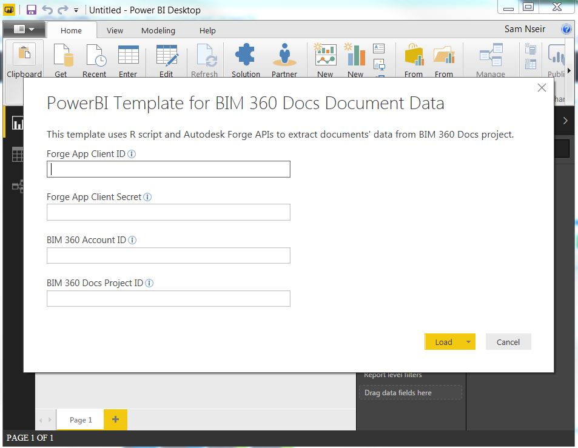
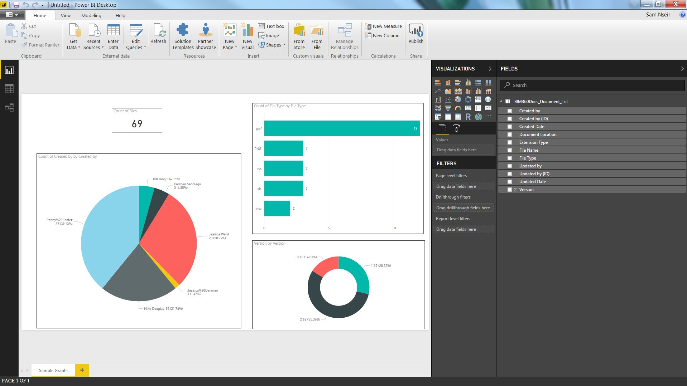

# bim360docs-documents-powerbi

R script that uses 2-legged OAuth and Data Management API to extract documents' attributes from [BIM 360 Docs](https://docs.b360.autodesk.com/login) project.

 

## Description

This is a sample code that shows how to use [R programming](https://www.r-project.org/) to extract documents' infromation from a [BIM 360 Docs](https://docs.b360.autodesk.com/login) project. The output of this script is a [data frame](http://www.r-tutor.com/r-introduction/data-frame) that contains document attributes from [BIM 360 Docs](https://adocs.b360.autodesk.com/login) project. A good way to use this script is by importing it as a [data source in Power BI Desktop](https://powerbi.microsoft.com/en-us/documentation/powerbi-desktop-data-sources/) to analyze BIM 360 Docs data.

## Setup
#### 1. Create Autodesk Forge App.
* Visit the [Forge Developer Portal](https://developer.autodesk.com) and sign up for an account
* [Create an App](https://developer.autodesk.com/myapps/create). Callback URL is not being used by this script. When asked for the 'callback URL', you can use any URL
* Take note of the **Client ID** and **Client Secret**.

#### 2. Add Custom Integration to BIM 360 Account
* Log into your BIM 360 Account Admin site, https://admin.b360.autodesk.com/. If you have access to multiple accounts, select the account the contains the project that you want to export documents' attributes from.
* Go to “SETTINGS” tab then to “Custom Integrations” tab
* Click on “Add Custom Integration” button to register your app for this specific account.
* Take note of the **BIM 360 Account ID**.

#### 3. Add Custom Integration to BIM 360 Account
* Log into your BIM 360 Docs, https://docs.b360.autodesk.com/ and select a project
* Take note of the **BIM 360 Docs Project ID** from the browser address bar. The **Project ID** is a 36 characters that follows **'https://docs.b360.autodesk.com/projects/'** (between  slashes).

#### 4. Setup R
* Install **[R](https://cran.r-project.org/mirrors.html)**:  Here is a guide on how to install R, http://rprogramming.net/how-to-install-r-fast/.
* Load **'httr'** and **'jsonlite'** packages: Here is a guide on how load packeges to R, https://www.statmethods.net/interface/packages.html.
* Install RStudio (optional): Here is a guide on how to download and install RStudio, http://rprogramming.net/download-and-install-rstudio/.

#### 5. Execute R script
Before executing the R script from the **Export BIM360 Company Data.R** file, input **Client ID**, **Client Secret**, **BIM 360 Account ID**, and **BIM 360 Docs Project ID** from steps 1, 2, & 3 into lines **6**, **7**, **8**, and **9** of the script.

#### 6. Execute R script in Power BI Desktop (Optional)
* Install **PowerBI Desktop**: Download from https://powerbi.microsoft.com/desktop/
* Click on **Get Data** and select **R Script**
* Copy the R script from the **Export BIM360 Company Data.R** file and Paste in the Script box
* Input **Client ID**, **Client Secret**, **BIM 360 Account ID**, and **BIM 360 Docs Project ID** from steps 1, 2, & 3 into lines **6**, **7**, **8**, and **9** of the script.
* Click Ok and select **BIM360Docs_Document_List** table to load it to PowerBI

## Power BI Template
To test how this R script works in Power BI, downlaod the following [PowerBI Template for BIM 360 Docs Document Data.pbit](http://autode.sk/bim360docsdocumentstemplate)

To run this template, you need  **Client ID**, **Client Secret**, **BIM 360 Account ID**, and **BIM 360 Docs Project ID** from steps 1, 2, & 3 in **Setup** and you need to setup R as per step 4 in **Setup**.

The successful loading of the template should show results similar to this. 

## License

This sample is licensed under the terms of the [MIT License](http://opensource.org/licenses/MIT).
Please see the [LICENSE](LICENSE) file for full details.

## Written by

Sam Nseir, P.E. [@samnseirpe](https://www.linkedin.com/in/samnseirpe/), [Autodesk Enterprise Priority Support](https://enterprisehub.autodesk.com/)
